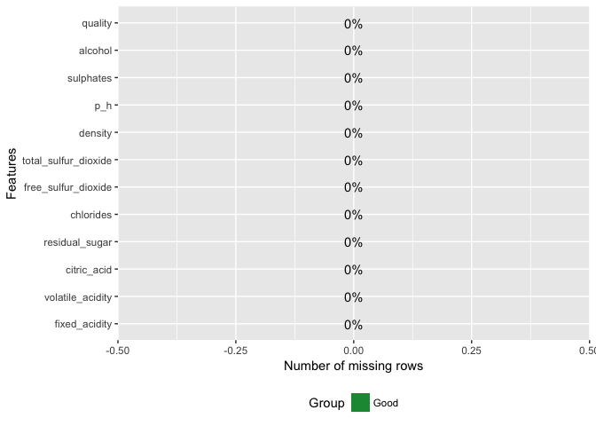
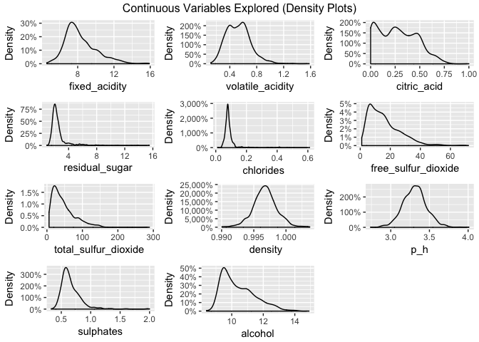
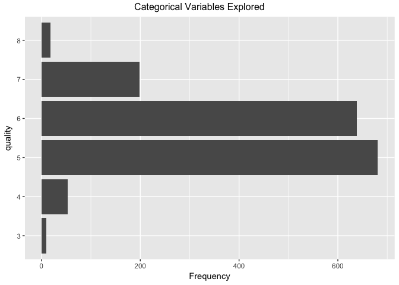

Tree Methods
================

``` r
# setting the appropriate working directory
setwd("~/Desktop/Personal/personal_code/classification/")

# setting scipen options to kill all use of scientific notation
options(scipen = 999)

# basic packages needed throughout
library(dplyr) # for piping
```

    ## 
    ## Attaching package: 'dplyr'

    ## The following objects are masked from 'package:stats':
    ## 
    ##     filter, lag

    ## The following objects are masked from 'package:base':
    ## 
    ##     intersect, setdiff, setequal, union

``` r
library(ggplot2) # for visualization
```

    ## 
    ## Attaching package: 'ggplot2'

    ## The following object is masked from 'package:dplyr':
    ## 
    ##     vars

``` r
library(ggthemes) # for custom visualization
```

Importing, Exploring, Cleaning, Normalizing / Centering, and Prepping the Data
==============================================================================

Importing the Data
------------------

-   Data taken from: <https://archive.ics.uci.edu/ml/machine-learning-databases/wine-quality/>
-   Explanation of the meaning / origin of the data can be found in this academic paper here: <http://www3.dsi.uminho.pt/pcortez/wine5.pdf>

``` r
# we have both red and white wine datasets with the same variables 
base_red <- read.csv("data/winequality-red.csv",sep=";")
base_white <- read.csv("data/winequality-white.csv",sep=";")

# lots of useful information about the dataset
glimpse(base_red) 
```

    ## Observations: 1,599
    ## Variables: 12
    ## $ fixed.acidity        <dbl> 7.4, 7.8, 7.8, 11.2, 7.4, 7.4, 7.9, 7.3, ...
    ## $ volatile.acidity     <dbl> 0.700, 0.880, 0.760, 0.280, 0.700, 0.660,...
    ## $ citric.acid          <dbl> 0.00, 0.00, 0.04, 0.56, 0.00, 0.00, 0.06,...
    ## $ residual.sugar       <dbl> 1.9, 2.6, 2.3, 1.9, 1.9, 1.8, 1.6, 1.2, 2...
    ## $ chlorides            <dbl> 0.076, 0.098, 0.092, 0.075, 0.076, 0.075,...
    ## $ free.sulfur.dioxide  <dbl> 11, 25, 15, 17, 11, 13, 15, 15, 9, 17, 15...
    ## $ total.sulfur.dioxide <dbl> 34, 67, 54, 60, 34, 40, 59, 21, 18, 102, ...
    ## $ density              <dbl> 0.9978, 0.9968, 0.9970, 0.9980, 0.9978, 0...
    ## $ pH                   <dbl> 3.51, 3.20, 3.26, 3.16, 3.51, 3.51, 3.30,...
    ## $ sulphates            <dbl> 0.56, 0.68, 0.65, 0.58, 0.56, 0.56, 0.46,...
    ## $ alcohol              <dbl> 9.4, 9.8, 9.8, 9.8, 9.4, 9.4, 9.4, 10.0, ...
    ## $ quality              <int> 5, 5, 5, 6, 5, 5, 5, 7, 7, 5, 5, 5, 5, 5,...

``` r
glimpse(base_white) 
```

    ## Observations: 4,898
    ## Variables: 12
    ## $ fixed.acidity        <dbl> 7.0, 6.3, 8.1, 7.2, 7.2, 8.1, 6.2, 7.0, 6...
    ## $ volatile.acidity     <dbl> 0.27, 0.30, 0.28, 0.23, 0.23, 0.28, 0.32,...
    ## $ citric.acid          <dbl> 0.36, 0.34, 0.40, 0.32, 0.32, 0.40, 0.16,...
    ## $ residual.sugar       <dbl> 20.70, 1.60, 6.90, 8.50, 8.50, 6.90, 7.00...
    ## $ chlorides            <dbl> 0.045, 0.049, 0.050, 0.058, 0.058, 0.050,...
    ## $ free.sulfur.dioxide  <dbl> 45, 14, 30, 47, 47, 30, 30, 45, 14, 28, 1...
    ## $ total.sulfur.dioxide <dbl> 170, 132, 97, 186, 186, 97, 136, 170, 132...
    ## $ density              <dbl> 1.0010, 0.9940, 0.9951, 0.9956, 0.9956, 0...
    ## $ pH                   <dbl> 3.00, 3.30, 3.26, 3.19, 3.19, 3.26, 3.18,...
    ## $ sulphates            <dbl> 0.45, 0.49, 0.44, 0.40, 0.40, 0.44, 0.47,...
    ## $ alcohol              <dbl> 8.8, 9.5, 10.1, 9.9, 9.9, 10.1, 9.6, 8.8,...
    ## $ quality              <int> 6, 6, 6, 6, 6, 6, 6, 6, 6, 6, 5, 5, 5, 7,...

``` r
# the datasets both have the same variables, but the red dataset has notably fewer observations
```

``` r
# given that the two datasets all have the same variables, we'll add a color variable to each and then combine

base_red <- base_red %>%
  mutate(color = "red")

base_white <- base_white %>%
  mutate(color = "white")

# combining the two data frames
main_wine_df <- bind_rows(base_red, base_white)

# viewing the newly combined data frame
glimpse(main_wine_df)
```

    ## Observations: 6,497
    ## Variables: 13
    ## $ fixed.acidity        <dbl> 7.4, 7.8, 7.8, 11.2, 7.4, 7.4, 7.9, 7.3, ...
    ## $ volatile.acidity     <dbl> 0.700, 0.880, 0.760, 0.280, 0.700, 0.660,...
    ## $ citric.acid          <dbl> 0.00, 0.00, 0.04, 0.56, 0.00, 0.00, 0.06,...
    ## $ residual.sugar       <dbl> 1.9, 2.6, 2.3, 1.9, 1.9, 1.8, 1.6, 1.2, 2...
    ## $ chlorides            <dbl> 0.076, 0.098, 0.092, 0.075, 0.076, 0.075,...
    ## $ free.sulfur.dioxide  <dbl> 11, 25, 15, 17, 11, 13, 15, 15, 9, 17, 15...
    ## $ total.sulfur.dioxide <dbl> 34, 67, 54, 60, 34, 40, 59, 21, 18, 102, ...
    ## $ density              <dbl> 0.9978, 0.9968, 0.9970, 0.9980, 0.9978, 0...
    ## $ pH                   <dbl> 3.51, 3.20, 3.26, 3.16, 3.51, 3.51, 3.30,...
    ## $ sulphates            <dbl> 0.56, 0.68, 0.65, 0.58, 0.56, 0.56, 0.46,...
    ## $ alcohol              <dbl> 9.4, 9.8, 9.8, 9.8, 9.4, 9.4, 9.4, 10.0, ...
    ## $ quality              <int> 5, 5, 5, 6, 5, 5, 5, 7, 7, 5, 5, 5, 5, 5,...
    ## $ color                <chr> "red", "red", "red", "red", "red", "red",...

``` r
library(janitor) # for data cleaning and tabular exploration
# documentation: https://github.com/sfirke/janitor

# first we'll do some mandatory / precautionary cleaning
# tidying variable names and dropping any useless rows / columns

main_wine_df <- main_wine_df %>%
  janitor::clean_names() %>% #converts to underscore case and cleans
  janitor::remove_empty(which = c("rows","cols")) # drops all rows and columns that are entirely empty
```

``` r
# for the purpose of simplicity, we are going to start by only looking at the red wine
red_main_df <- main_wine_df %>%
  # filtering to just the red wine
  filter(color == "red") %>%
  # dropping the now-useless variable
  select(-color) %>%
  # ensuring quality is a factor; this will be useful later
  # as a rule of thumb, it's good to factor any non-numeric variables when glm modeling
  mutate(quality = factor(quality))

# examining the newly created dataset
glimpse(red_main_df)
```

    ## Observations: 1,599
    ## Variables: 12
    ## $ fixed_acidity        <dbl> 7.4, 7.8, 7.8, 11.2, 7.4, 7.4, 7.9, 7.3, ...
    ## $ volatile_acidity     <dbl> 0.700, 0.880, 0.760, 0.280, 0.700, 0.660,...
    ## $ citric_acid          <dbl> 0.00, 0.00, 0.04, 0.56, 0.00, 0.00, 0.06,...
    ## $ residual_sugar       <dbl> 1.9, 2.6, 2.3, 1.9, 1.9, 1.8, 1.6, 1.2, 2...
    ## $ chlorides            <dbl> 0.076, 0.098, 0.092, 0.075, 0.076, 0.075,...
    ## $ free_sulfur_dioxide  <dbl> 11, 25, 15, 17, 11, 13, 15, 15, 9, 17, 15...
    ## $ total_sulfur_dioxide <dbl> 34, 67, 54, 60, 34, 40, 59, 21, 18, 102, ...
    ## $ density              <dbl> 0.9978, 0.9968, 0.9970, 0.9980, 0.9978, 0...
    ## $ p_h                  <dbl> 3.51, 3.20, 3.26, 3.16, 3.51, 3.51, 3.30,...
    ## $ sulphates            <dbl> 0.56, 0.68, 0.65, 0.58, 0.56, 0.56, 0.46,...
    ## $ alcohol              <dbl> 9.4, 9.8, 9.8, 9.8, 9.4, 9.4, 9.4, 10.0, ...
    ## $ quality              <fct> 5, 5, 5, 6, 5, 5, 5, 7, 7, 5, 5, 5, 5, 5,...

Exploring the Data
------------------

``` r
# Even though we dropped any rows / cols that are entirely null, we need to check for NA problems
library(DataExplorer) # allows for creation of missings values map
# documentation for DataExplorer: https://towardsdatascience.com/simple-fast-exploratory-data-analysis-in-r-with-dataexplorer-package-e055348d9619
DataExplorer::plot_missing(red_main_df) # shows % of NAs within each variable
```



``` r
# good news is this dataset looks perfectly clean of nulls!
# If there were any problems with nulls, we would solve it using complete.cases() or something similar
```

### Continous Variables Exploration

``` r
# high-level univariate variable-exploration
# first a histogram of all continuous variables in the dataset
DataExplorer::plot_histogram(data = red_main_df, title = "Continuous Variables Explored (Histograms)")
```


``` r
# then a density chart of all continous variables in the dataset
DataExplorer::plot_density(data = red_main_df, title = "Continuous Variables Explored (Density Plots)")
```



### Categorical Variable Exploration

``` r
# the only categorical variable in our data in this case is what we'll use to create our low quality flag
# if we had many categorical variables, it would make sense to use order_bar = TRUE
# the order would then be in descending order of prevalence, which is helpful at a glance
plot_bar(data = red_main_df, order_bar = FALSE, title = "Categorical Variables Explored")
```



``` r
# and then we can use janitor to see the exact cross-tab of our quality variable
janitor::tabyl(red_main_df$quality)
```

    ##  red_main_df$quality   n     percent
    ##                    3  10 0.006253909
    ##                    4  53 0.033145716
    ##                    5 681 0.425891182
    ##                    6 638 0.398999375
    ##                    7 199 0.124452783
    ##                    8  18 0.011257036

``` r
# it looks like wines with a rating < 5 are exceptionally bad, so we'll use that as our benchmark
# all together wines with a rating below 5 represent just under 4% of the population
```

### Outcome Variable Creation

``` r
# given the above analysis, we'll flag anything with a quality rating < 5 as low-quality 
red_final_df <- red_main_df %>%
  # type conversion here can be tricky because to de-factor requires multiple steps
  # we have to de-factor, perform the logical test on the numeric, and then re-factor
  mutate(low_qual_flag = factor(ifelse(as.numeric(as.character(quality)) < 5,1,0))) %>%
  select(-quality)

glimpse(red_final_df) # taking another look at the new dataset
```

    ## Observations: 1,599
    ## Variables: 12
    ## $ fixed_acidity        <dbl> 7.4, 7.8, 7.8, 11.2, 7.4, 7.4, 7.9, 7.3, ...
    ## $ volatile_acidity     <dbl> 0.700, 0.880, 0.760, 0.280, 0.700, 0.660,...
    ## $ citric_acid          <dbl> 0.00, 0.00, 0.04, 0.56, 0.00, 0.00, 0.06,...
    ## $ residual_sugar       <dbl> 1.9, 2.6, 2.3, 1.9, 1.9, 1.8, 1.6, 1.2, 2...
    ## $ chlorides            <dbl> 0.076, 0.098, 0.092, 0.075, 0.076, 0.075,...
    ## $ free_sulfur_dioxide  <dbl> 11, 25, 15, 17, 11, 13, 15, 15, 9, 17, 15...
    ## $ total_sulfur_dioxide <dbl> 34, 67, 54, 60, 34, 40, 59, 21, 18, 102, ...
    ## $ density              <dbl> 0.9978, 0.9968, 0.9970, 0.9980, 0.9978, 0...
    ## $ p_h                  <dbl> 3.51, 3.20, 3.26, 3.16, 3.51, 3.51, 3.30,...
    ## $ sulphates            <dbl> 0.56, 0.68, 0.65, 0.58, 0.56, 0.56, 0.46,...
    ## $ alcohol              <dbl> 9.4, 9.8, 9.8, 9.8, 9.4, 9.4, 9.4, 10.0, ...
    ## $ low_qual_flag        <fct> 0, 0, 0, 0, 0, 0, 0, 0, 0, 0, 0, 0, 0, 0,...

``` r
tabyl(red_final_df$low_qual_flag)
```

    ##  red_final_df$low_qual_flag    n    percent
    ##                           0 1536 0.96060038
    ##                           1   63 0.03939962

``` r
# the data now look nice and clean!
```

Centering and Normalizing the Data
----------------------------------

It would appear as though in the case of tree-based methods, or recursive partitioning methods in general, centering and scaling of the data is not strictly speaking necessary as part of the modeling process. I will include links to support this below, but the basic premise is this: Any algorithm based on recursive partitioning, such as decision trees, and regression trees does not require inputs (features) to be normalized, since it is invariant to monotonic transformations of the features (just think about how the splits are done at each node). Since random forests (as well as gbm) are just a collection of trees, there is no need to normalize.

-   <https://stats.stackexchange.com/questions/57010/is-it-essential-to-do-normalization-for-svm-and-random-forest>
-   <https://datascience.stackexchange.com/questions/16225/would-you-recommend-feature-normalization-when-using-boosting-trees>
-   <https://www.quora.com/Should-inputs-to-random-forests-be-normalized>

Prepping Data for the Modeling Process
--------------------------------------

``` r
# split the data into training and testing sets
library(caret) # needed to createDataPartitions
```

    ## Loading required package: lattice

    ## Warning in as.POSIXlt.POSIXct(Sys.time()): unknown timezone 'zone/tz/2018c.
    ## 1.0/zoneinfo/America/New_York'

``` r
# Partition data: 80 / 20 split : train / test
# set seed to ensure reproducibility
set.seed(777)

in_train <- caret::createDataPartition(y=red_final_df$low_qual_flag, p=0.80, list=FALSE)

# splits the data into training and testing sets
training <- red_final_df[in_train,]
testing <- red_final_df[-in_train,]

# shows the row count and column count of the training and test sets, to check that all worked as planned
dim(training)
```

    ## [1] 1280   12

``` r
dim(testing)
```

    ## [1] 319  12

Building a Basic Tree
=====================

Fitting the tree
----------------

There are two main packages that we could use when building a tree-based model that are widely accepted today--rpart and party. The methodology for rpart is far easier to explain than party. The latter, however, is much more sophisticated and likely to give better models. For a fuller explanation of this, see the link below.

-   <https://stats.stackexchange.com/questions/22035/partitioning-trees-in-r-party-vs-rpart>

``` r
library(partykit) # needed for ctree
```

    ## Loading required package: grid

``` r
# simple tree model

# build model
wine_ctree_model = ctree(low_qual_flag ~ ., 
              data = training)

# visualise model
plot(wine_ctree_model, type="simple")
```


``` r
# getting tree model probabilities from for our testing set 
ctree_fit_probs <- predict(wine_ctree_model,
                           newdata = testing,
                           type = "response")

# turning these probabilities into classifications using our population mean as our baseline
ctree_fit_predictions <- factor(ifelse(as.numeric(as.character(ctree_fit_probs)) > 0.039, 1, 0),levels=c('0','1'))

# builiding a confusion matrix to test model accuracy metrics
caret::confusionMatrix(ctree_fit_predictions,testing$low_qual_flag, positive='1')
```

    ## Confusion Matrix and Statistics
    ## 
    ##           Reference
    ## Prediction   0   1
    ##          0 307  12
    ##          1   0   0
    ##                                           
    ##                Accuracy : 0.9624          
    ##                  95% CI : (0.9352, 0.9804)
    ##     No Information Rate : 0.9624          
    ##     P-Value [Acc > NIR] : 0.575979        
    ##                                           
    ##                   Kappa : 0               
    ##  Mcnemar's Test P-Value : 0.001496        
    ##                                           
    ##             Sensitivity : 0.00000         
    ##             Specificity : 1.00000         
    ##          Pos Pred Value :     NaN         
    ##          Neg Pred Value : 0.96238         
    ##              Prevalence : 0.03762         
    ##          Detection Rate : 0.00000         
    ##    Detection Prevalence : 0.00000         
    ##       Balanced Accuracy : 0.50000         
    ##                                           
    ##        'Positive' Class : 1               
    ## 

Trying to build a random forest
-------------------------------

Some information on random forest models vs. ctree, etc.:

-   <https://www.r-bloggers.com/binary-classification-a-comparison-of-titanic-proportions-between-logistic-regression-random-forests-and-conditional-trees/>

``` r
require(randomForest)
```

    ## Loading required package: randomForest

    ## randomForest 4.6-12

    ## Type rfNews() to see new features/changes/bug fixes.

    ## 
    ## Attaching package: 'randomForest'

    ## The following object is masked from 'package:ggplot2':
    ## 
    ##     margin

    ## The following object is masked from 'package:dplyr':
    ## 
    ##     combine

``` r
# fitting the model with 500 trees
wine_rf_model <- randomForest(low_qual_flag ~ ., 
                              data = training, 
                              ntree=500)

wine_rf_model
```

    ## 
    ## Call:
    ##  randomForest(formula = low_qual_flag ~ ., data = training, ntree = 500) 
    ##                Type of random forest: classification
    ##                      Number of trees: 500
    ## No. of variables tried at each split: 3
    ## 
    ##         OOB estimate of  error rate: 4.45%
    ## Confusion matrix:
    ##      0 1 class.error
    ## 0 1223 6 0.004882018
    ## 1   51 0 1.000000000

``` r
# getting tree model probabilities from for our testing set 
wine_rf_probs <- predict(wine_rf_model,
                           newdata = testing,
                           type = "response")

# turning these probabilities into classifications using our population mean as our baseline
wine_rf_predictions <- factor(ifelse(as.numeric(as.character(wine_rf_probs)) > 0.01, 1, 0),levels=c('0','1'))

# builiding a confusion matrix to test model accuracy metrics
caret::confusionMatrix(wine_rf_predictions,testing$low_qual_flag, positive='1')
```

    ## Confusion Matrix and Statistics
    ## 
    ##           Reference
    ## Prediction   0   1
    ##          0 307  12
    ##          1   0   0
    ##                                           
    ##                Accuracy : 0.9624          
    ##                  95% CI : (0.9352, 0.9804)
    ##     No Information Rate : 0.9624          
    ##     P-Value [Acc > NIR] : 0.575979        
    ##                                           
    ##                   Kappa : 0               
    ##  Mcnemar's Test P-Value : 0.001496        
    ##                                           
    ##             Sensitivity : 0.00000         
    ##             Specificity : 1.00000         
    ##          Pos Pred Value :     NaN         
    ##          Neg Pred Value : 0.96238         
    ##              Prevalence : 0.03762         
    ##          Detection Rate : 0.00000         
    ##    Detection Prevalence : 0.00000         
    ##       Balanced Accuracy : 0.50000         
    ##                                           
    ##        'Positive' Class : 1               
    ##
